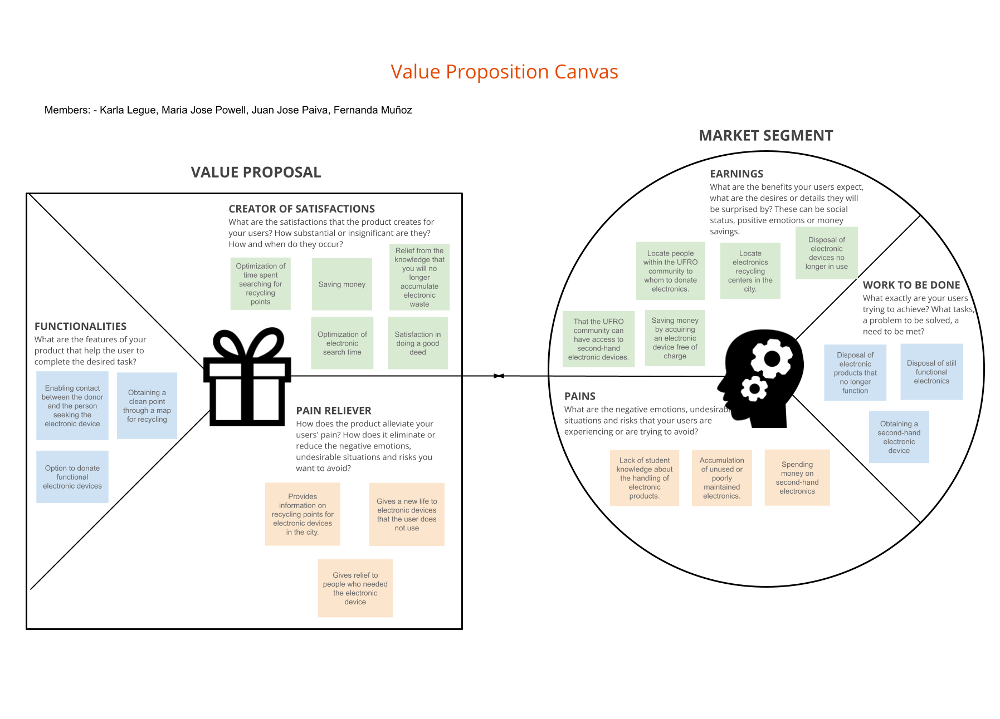
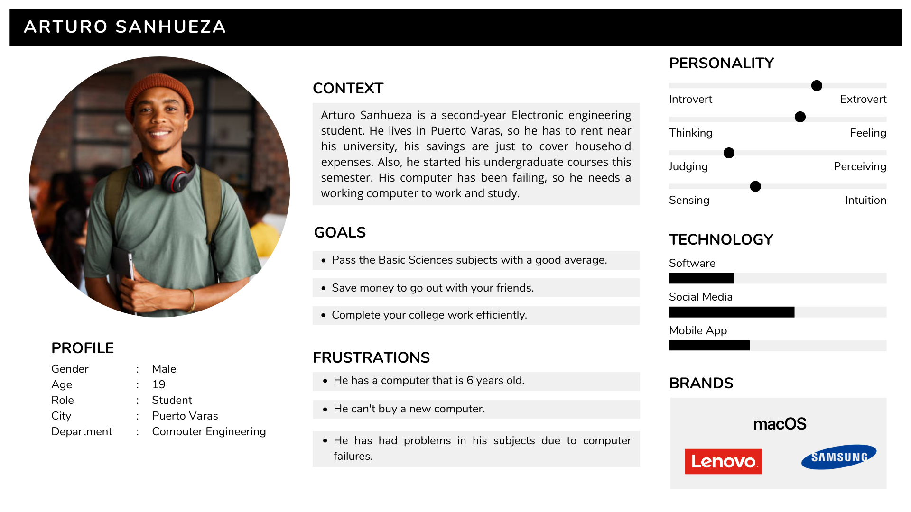
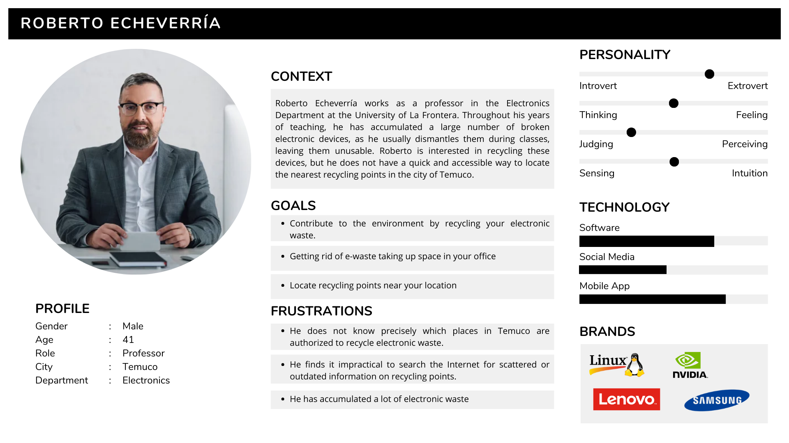
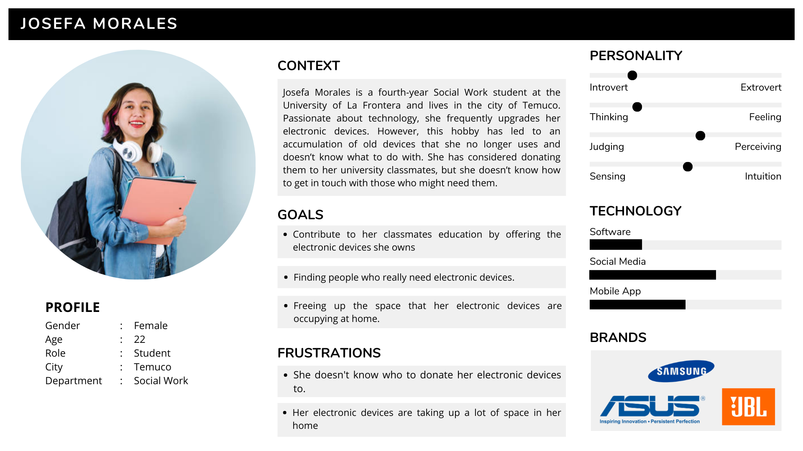

# ReTech-UXD

User experience design for ReTech application o donate recycled electronic devices, upload publications and locate recycling points.

## Índice

* [1. Description](#Description)
* [2. Strategy](#Strategy)
* [3. Scope](#Scope)
  * [3.1 UX Personas](#ux-personas)
  * [3.2 Customer Journey Map](#customer-journey-map)
  * [3.3 Benchmark](#benchmark)
* [4. Structure](#structure)
* [5. Skeleton](#skeleton)
* [6. Surface](#surface)
* [7. Team](#Team)

## Description

The problem to be solved is the accumulation of electronic devices that people keep. Where most of them are still working or some reasons may be that the person bought another device or no longer uses the electronic device.  Such as cell phones, computers, chargers, etc. The solution we found is to find a new life for these electronic devices, for a person in need or to recycle the device in order to reuse its parts.

Through a mobile application, where the user will publish the electronic devices that are not used and locate recycling points that receive electronic devices that work. publicas tu dispositivo y si un usuario esta interesado habra un espacio de comunicacion para decidir un punto de encuentro y hacer la entrega.

## Strategy

At this point we will start with the first step of the Elements of User Experience which is the Strategy plane. A Value Proposition Canvas was created to understand and design the value proposition for the problem we seek to solve, identifying the customer's needs and desires, as well as their pain points.

In this photo is the Value Proposition Canva based on how to donate electronic devices to be recycled.

## Scope

When defining the product strategy using the value proposition canvas, we must define the scope plane. 

### UX Personas

In this section when defining the structure plan, we have to define the scope plane, starting with the creation of UX Personas to define the possible users that will be interested in people to donate functional electronic devices.

By creating Personas with different contexts where a person is required to donate a device, such as a user who needs it or wants to get rid of the accumulation of electronic devices.

### Customer Journey Map

Based on the creation of UX Personas we define the Customer Journey Map to identify what is wanted from the application to design.

(insertar foto traducida)

### Benchmark

## Structure

## Skeleton

## Surface

## Team

Maria José Powell - Designer

Karla Legue -

Juan José Paiva -

Fernanda Muñoz -
