# ReTech-UXD

User experience design for the ReTech application for electronic device donation, uploading publications and chatting with people interested in donating electronic devices and agreeing on a meeting point.

## Index

* [1. Description](#Description)
* [2. Strategy](#Strategy)
* [3. Scope](#Scope)
  * [3.1 UX Personas](#ux-personas)
  * [3.2 Customer Journey Map](#customer-journey-map)
  * [3.3 Benchmark](#benchmark)
* [4. Structure](#structure)
* [5. Skeleton](#skeleton)
* [6. Surface](#surface)
  * [6.1 Mockups v1](#mockups-v1)
  * [6.2 Mockups v2](#mockups-v2)
* [7. Heuristic Evaluation](#Heuristic-Evaluation)
* [8. Team](#Team)
  
## Description

At UFRO, students have functional but unused electronic devices. However, they lack an adequate platform to easily and securely donate them to other students who might need them.

This lack of an efficient connection channel limits device reuse, generates an unnecessary accumulation of electronic waste, and wastes opportunities for student solidarity.

## Strategy

At this point, we'll begin with the first step of the User Experience Elements, which is the Strategy blueprint. A Value Proposition Canvas was created to understand and design the value proposition for the problem we seek to solve, identifying the customer's needs and desires, as well as their pain points.

The following image shows the Value Proposition Canvas based on donating electronic devices for reuse. The value of the problem is identified, based on the pain points, satisfaction, and benefits that users who accumulate electronic devices would receive by donating them.

The following image shows the value proposition canvas developed around the donation of electronic devices for reuse. It analyzes the value of the problem, considering the weaknesses faced by users who accumulate these devices, as well as the satisfaction and benefits they can obtain by donating them to those who need them.

It is important to note that, in the final version of the canvas, everything related to recycling points was removed in order to focus the proposal exclusively on donations, promoting the reuse of electronics through a solidarity network among members of the UFRO community.

[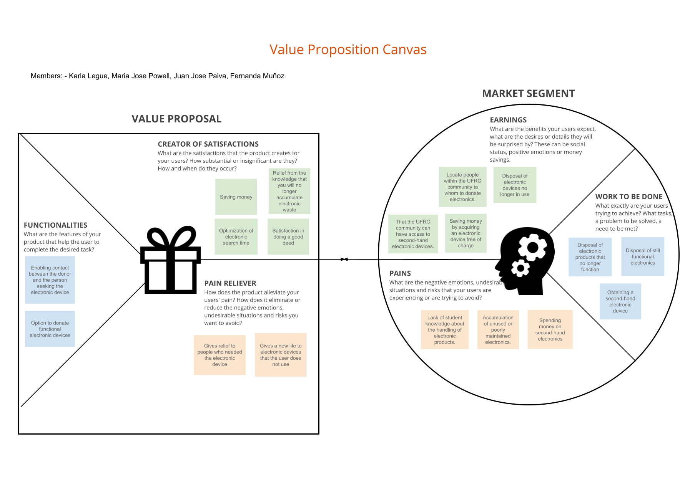](Files/Final_Value_Proposition_Canvas_ReTech.png)

## Scope

When defining the product strategy using the value proposition canvas, we must define the scope plane. In this plane describes the functional and content requirements of your product, as well as the user stories and scenarios that describe how users will interact with it. You also identify the users who would be interested in the product and create user flows, site maps and information architecture diagrams to show how your product will be structured and organized.

### UX Personas

In this section when defining the structure plan, we have to define the scope plane, starting with the creation of UX Personas to define the possible users that will be interested in people to donate functional electronic devices.

By creating Personas with different contexts where a person is required to donate a device, such as a user who needs it or wants to get rid of the accumulation of electronic devices.

Due to the elimination of recycling points, it was decided to focus solely on users with context, goals, and frustrations related to donations. Therefore, Roberto Echeverría's information was updated to respond to these new requirements.

[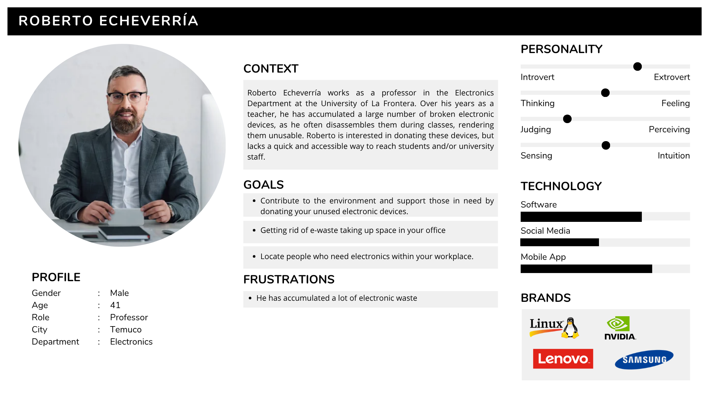](Files/UX_PERSONAS_FINAL.png)

### Customer Journey Map

Based on the creation of UX Personas we define the Customer Journey Map to identify what is wanted from the application to design.

[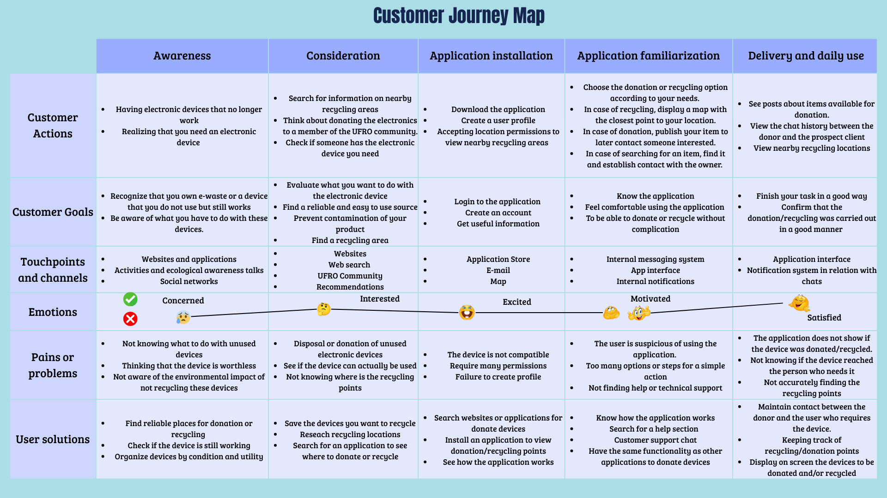](Files/Customer_Journey_Map,png)

In this updated version, all information related to recycling points has been removed to focus exclusively on the process of donating electronic devices. This decision allows the user experience to focus on specific actions within the app.

In this way, the Customer Journey Map more accurately reflects the actual flow that users will experience in ReTech.

[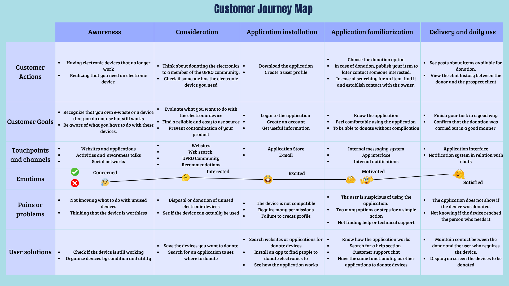](Files/Final_Customer_Journey_Retech.png)

### Benchmark

Benchmarking in UX Design allows you to validate designs according to project objectives, compare the product with competitors, and track potential results over time.

Based on the points identified in the previous section, a benchmark canvas was made to validate the objective of our project and to make comparisons with different competitors.

[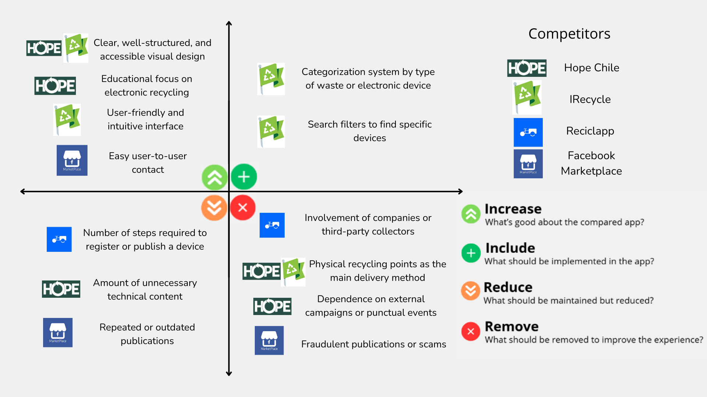](Files/Benchmarking.png)

Competitors are more detailed in this document

[Benchmarking Full Document (PDF)](Files/Benchmarking_.pdf)

## Structure

The design and navigation of a product is defined in the structure plane, in the case of this project to design an application to donate or recycle electronic devices, it is necessary to know how the navigation of the application will be carried out.

In the Site Map shows how the navigation of the application works. From logging in, viewing the feed, posting or editing publications, searching for recycling points and talking to the person interested in the advertised device, in addition view the profile user.

[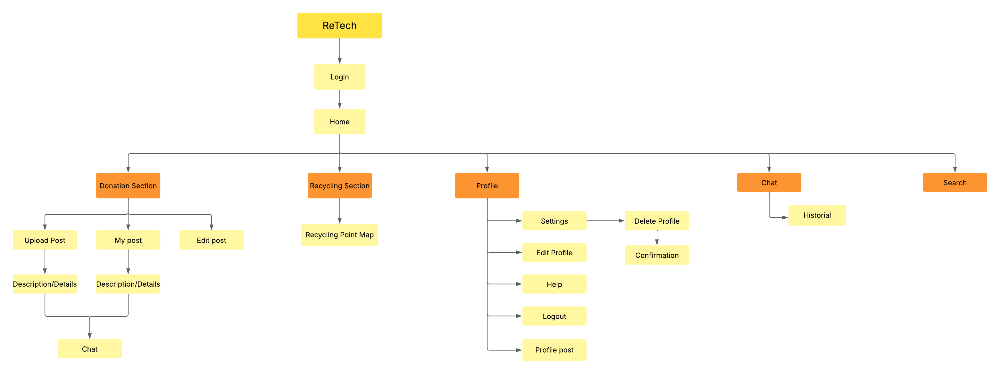](Files/Site_Map_ReTech.png)

Below is the final site map, which details the final navigation of the application.

This update includes new features and important improvements. A notifications section has been added, where users can rate the donor once the donation is complete.

Specific actions for posts have also been added, such as marking as donated, editing, or deleting, allowing users to have greater control over their contributions within the platform.

The Settings section has been expanded and now includes all relevant options: edit profile, privacy, terms and conditions, notifications, help and support, passwords and security, as well as the option to log out.

In the chat section, a new navigation feature has been implemented that allows conversations to be organized into two categories: “My donations” and “My interests,” making it easier to follow exchanges.

Finally, a section has been added where it is possible to view donations posted by other users. From there, you can open a chat if you are interested in a product or report the post if it violates security rules.

[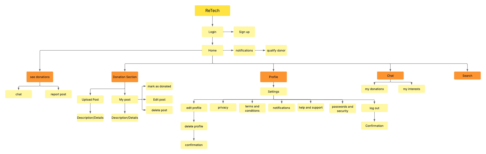](Files/Final_Site_Map_ReTech.png)

## Skeleton
The fourth plane, which is the skeleton, is where the graphic interface is designed, the navigation and how components such as buttons, text, images, etc. will be placed. Wireframes are a visual representation of what users will see and interact with in the application. The purpose of a wireframe is to visualize the concept of the project. 

In this case to make a design for an application to donate electronic devices. Designing the visualization of how this application will work, with its components and screens. 

Below are the wireframes designed for the mobile application where you upload publications to donate electronic devices, as well as talk to people interested in your publications and schedule a meeting point.

[Wireframes full Document here (PDF)](Files/Wireframes.pdf)

## Surface
Finally, there is the surface plane, where the actual interface that users will see and interact with is designed, as well as the content that the application will present.

### Mockups v1
With the design of the screens you can see the colors, components and operation of the application, shown below.

Login 

Sign up

Home

Publication view

Chat history

Chat

Search 

In the application publishes the electronic devices that the user has, in addition to being able to edit it in case of publication errors.

Add publication

Edit publication

In the screens add publication and edit publication, a pop-up window was designed that warns that if you leave the screen the changes will not be saved.

To recycle the map shows recycling points based on location.

Map

In the search screen, it will display a pop-up window asking for location permissions.

Profile

Configuration

[Interfaces full Document here](Files/Interfaces.png)

### Mockups v2

Based on teacher feedback and heuristic evaluation of our course classmates, we have changed the interfaces of the application, some functionalities, aesthetics, colors and improve the main functionalities of the application.

As a group we decided on a dark palette with a less light green color, with the background color a very dark gray that is not completely black.

The changes that were made was to eliminate the functionality to view the map. Because it was unnecessary to focus only on the donation of electronic devices. Since the map was useful to see the recycling points that are in the UFRO, but recycling was no longer the focus of the application, so it was decided to eliminate it and only focus on these main features:

- View publications of electronic devices that are being donated.
- Search for specific electronic devices.
- Publish an electronic device you want to donate.
- Chat with people who want to donate a device or talk to people interested in the devices that the user posted.
- User profile screen

The main screens of the application are as follows.

The front page of the application at start up.

This screen briefly and clearly presents the main purpose of our application, with the aim of helping users understand what it is for from the outset and encouraging them to explore it.

[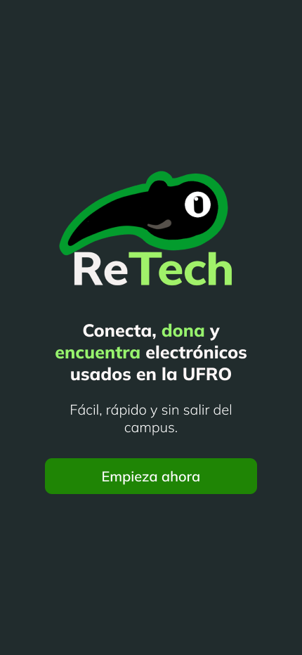](Files/mockups/v2/Principal.png)

Login and sign up 

[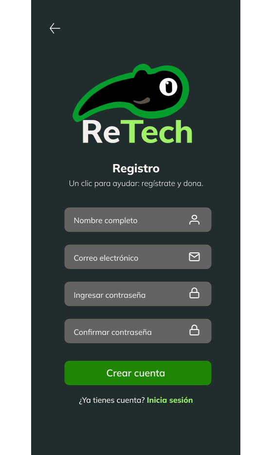](Files/mockups/v2/Registrar.png)

The home screen shows the different electronic devices that have been published by users.

[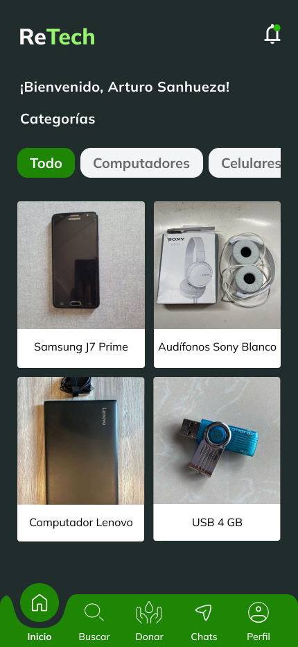](Files/mockups/v2/Inicio.png)

The home screen has a filter that displays specific categories of electronic devices that users have posted. Such as computers, cell phones, and others.

[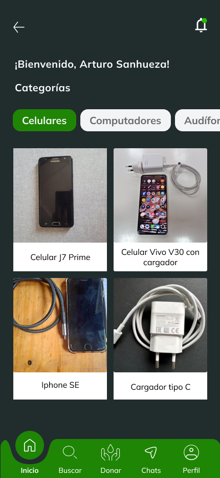](Files/mockups/v2/Celulares.png)

The navigation bar on the home screen has five options: home screen, search, donate a device, chat conversation, and user profile.

First, we have the search screen, for searching for specific electronic devices.

[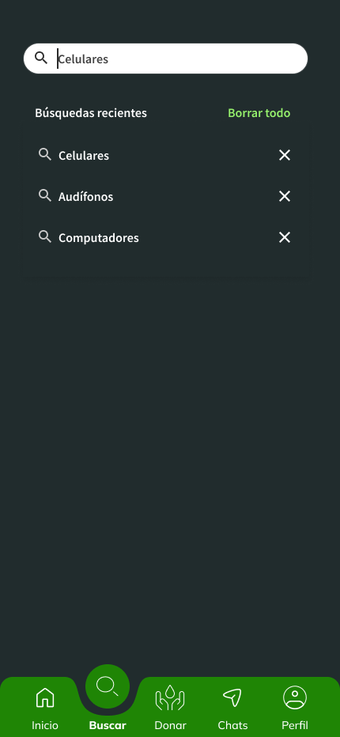](Files/mockups/v2/Buscar.png)

On the post a device screen, you can post a device you want to donate, adding a title, an image, selecting the category and the description of the device.

When you posting the device, you can view, delete, and edit the publication. You can also mark it as donated if you have donated it to an interested party.

You can explore other users' posts and, if any interest you, click on the “Send message to donor” button to be redirected to the chat screen. You can also view the profile of the user who posted the device, along with their star rating, which helps to build trust and confidence when finalizing the donation.

On the browsing chat screen, there are two tabs, one to go to the user's interests chat screen and the other is the my donations chat screen.

In the my interests chat screen , you can talk to the donor of the device of interest, decide to meet at a specific point if the user is interested in the device.

When a specific point decided by the donor and the person is made delivery of the donated device, you will receive a notification that the donation was made and to qualify the donor who delivered the electronic device.

[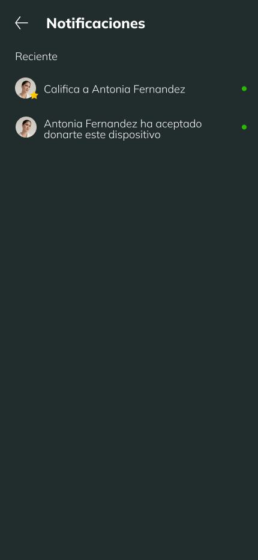](Files/mockups/v2/Notificación.png)

In the my donations chat screen, you can decide to meet at a specific point if the person is interested in the electronic device you posted.

In the navigation bar, the profile button you can see your profile, with your posts to view or edit them.

On the profile screen, users will find the Settings button, where they can manage various aspects of their account and customize their experience within the ReTech app. This section is organized into several options that allow users to maintain control and security of their account, as well as resolve questions or report issues. The available features are detailed below:

1. Edit profile
This option allows users to make changes to the information associated with their profile. Available actions include changing the profile picture and cover photo, updating the personal description, modifying the registered email address, and accessing the account deletion option.

2. Password and security
In this section, users can view the latest logins to their account. This feature is designed to provide greater control over recent activity, allowing users to detect suspicious access. If an unrecognized action is identified, the user can change their password and log out of all devices that do not belong to them.

3. Notifications
From this screen, users can manage which notifications they wish to receive from ReTech. Alerts can be enabled or disabled.

4. Privacy
With a commitment to transparency, this section clearly states what personal data is collected, for what purposes it is used, and what measures are taken to protect it.

5. Help and support
This section contains answers to frequently asked questions (FAQs), aimed at resolving common queries related to the operation of the application. If the user needs personalized assistance, they have the option of sending a message directly to the support team, who will respond as quickly as possible to provide a solution.

6. Terms and conditions
This section details the terms and conditions established by the ReTech team to ensure proper, safe, and respectful use of the platform. Users are encouraged to read this section carefully to understand their rights and responsibilities within the application.

7. Report a problem
If a user detects an error, malfunction, or any technical issue within the application, they can report it from this section. You will be asked to describe the problem in detail and, if you wish, you can include your email address to receive a direct response from the technical team with a possible solution or follow-up.

[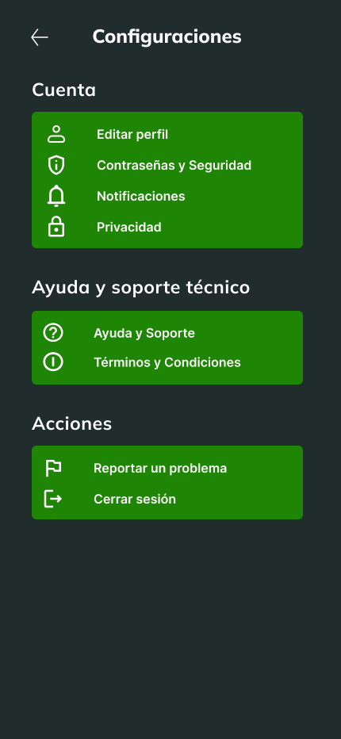](Files/mockups/v2/Configuracion.png)

Here is the link to the final mockups with the application flow and the file with all the final mockups.

[ReTech Application Flow](https://www.figma.com/design/2BXptp8VpephnWdWNgxuK6/Idea-de-correcci%C3%B3n?node-id=0-1&p=f&t=jq9G6QoVeRkm0kIu-0)

[View Mockups v2](Files/mockups/v2/mockups.md)

## Heuristic Evaluation

In the heuristic evaluation of our ReTech application, the five most critical problems were identified, which are detailed below:

Based on this assessment, we decided to make the corresponding improvements, starting with the problem identified with ID 1. This problem was related to a lack of clarity about the purpose of the application, so we worked on refining and better communicating its objective.

On the main screen, we added a brief but clear description explaining that ReTech is focused on the donation of electronic devices. In addition, we incorporated a prominent option in the navigation bar (navbar) called “Donate,” where users can post details about the device they wish to donate.

This idea was also reinforced in other sections of the application. For example, when a person completes the donation process, a pop-up window appears thanking them for their contribution.

## Team

Maria José Powell - Designer

Karla Legue - Designer

Juan José Paiva - Project Manager

Fernanda Muñoz - Project Manager
